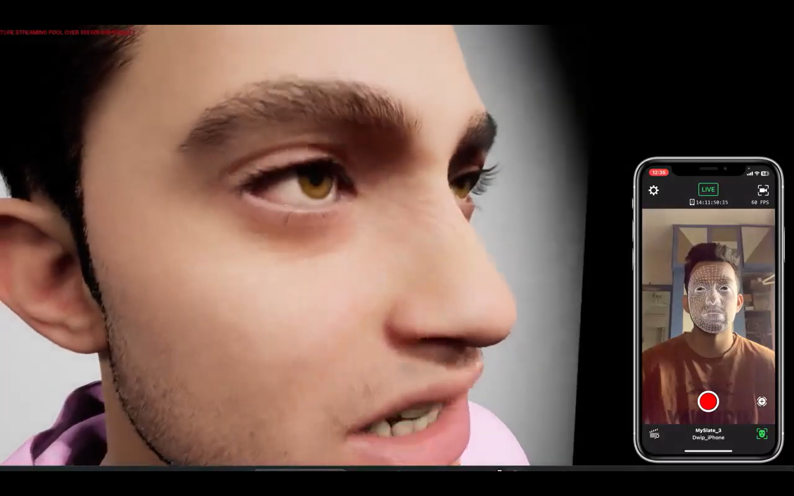

# My Metahuman
I created my own mediocre Metahuman in Unreal Engine 5.2 using the "Mesh to Metahuman" tool and capturing expressions with Unreal's Live Link Face app through my iPhone.
Motion captures are almost subsequent to the natural face with skin wrinkles toning, etc.

See the project in action here => https://www.youtube.com/watch?v=om-QB_FX09w

## Screenshot

## License
[MIT](https://choosealicense.com/licenses/mit/)
